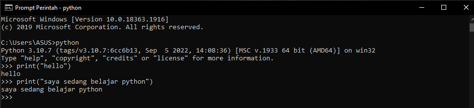
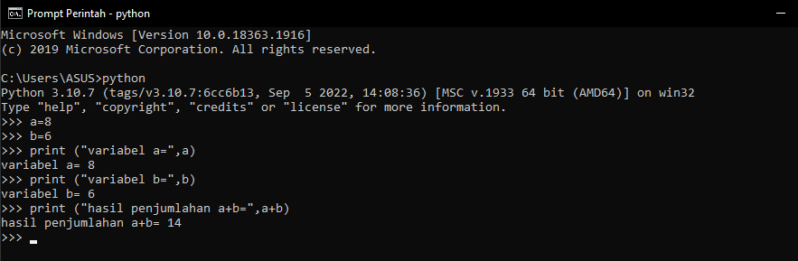
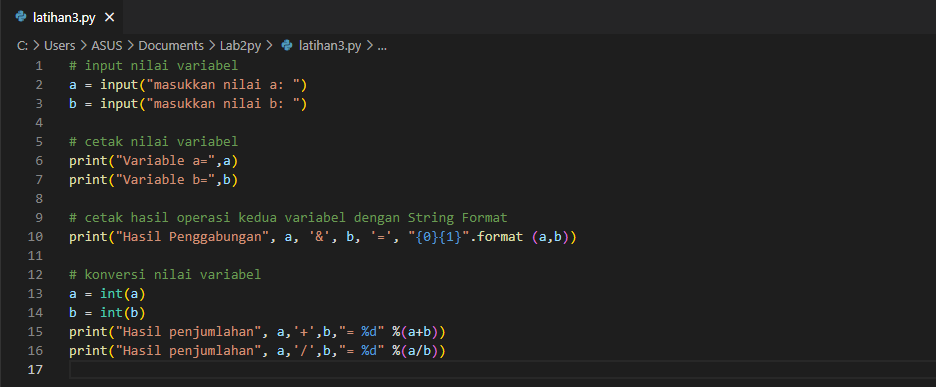
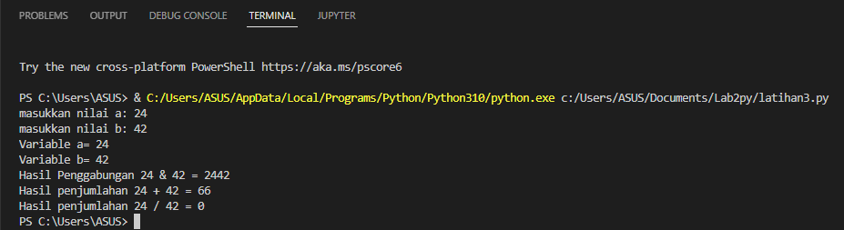
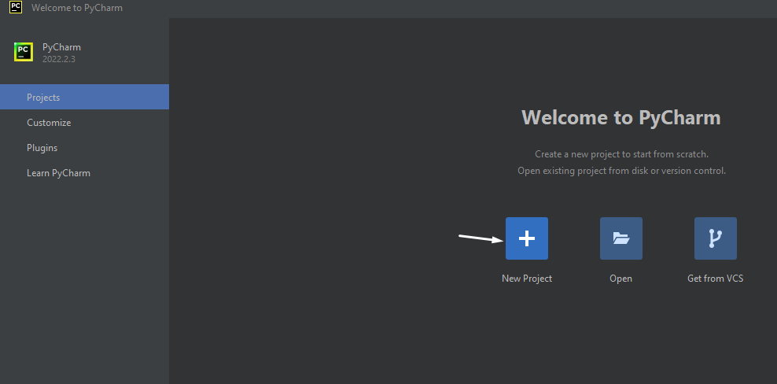

# Proses / Langkah-langkah Praktikum

## Latihan 1
### 1.Menjalankan tulisan "Hello" dilayar
### 2.Menampilkan tulisan "Saya sedang belajar python" dilayar

## Latihan 2
### Menjumlahkan dua buah variabel bilangan menggunakan variabel a dan b
### 1.Mendefinisikan variabel a dengan nilai 8
### 2.Mendefinisikan variabel b dengan nilai 6
### 3.Mencetak nilai variabel a dan b 
### 4.Mencetak hasil penjumlahan a+b

## Latihan 3 
### 1.Menjalankan IDLE
### 2.Membuat file baru dengan nama *latihan3.py* (pastikan lokasi file pada folder lab2py pada direktori anda)
### 3.Menggunakan fungsi *input* untuk mengambil nilai variabel dari keyboard

## Langkah-langkah Menggunakan PyCharm
### Jika belum terinstal, silahkan download di https://www.jetbrains.com/pycharm/
### Setelah selesai instalasi, buka *PyCharm*
### Membuat laman kerja baru dengan menekan (+) atau Create New Project

## Virtual Environment

## Menambahkan File Baru

## Menjalankan Program
